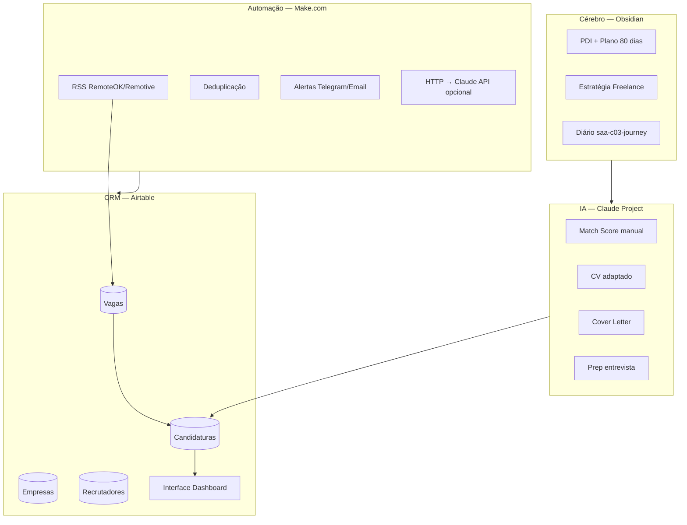

# Holocron Career AI — Stack 100% No-Code

> **Decisão:** zero código. CRM, automações, IA e dashboard com ferramentas visuais.  
> **Substitui:** FastAPI, Next.js, PostgreSQL, deploy AWS (Fase 1–8 anterior).

---

## Princípio

| Antes (código) | Agora (no-code) |
|---|---|
| FastAPI + PostgreSQL | **Airtable** (banco + CRM) |
| Next.js dashboard | **Airtable Interfaces** ou **Notion** |
| Strands Agents | **Make.com** + **Claude Project** |
| RAG custom | **Claude Project** (upload CV/docs) |
| MkDocs / repo código | **Obsidian** (cérebro + PDI) |
| CI/CD GitHub | **GitHub** só para diário público (`saa-c03-journey`) |

---

## Stack definitiva

---

## Documentos desta stack

| Doc | Conteúdo |
|---|---|
| [[ESTRATEGIA-NOCODE\|Estratégia No-Code]] | Por que e como |
| [[AIRTABLE-BASE-DESIGN\|Design da Base Airtable]] | Tabelas, campos, views |
| [[MAKE-CENARIOS\|Cenários Make.com]] | RSS, dedup, alertas |
| [[CLAUDE-PROJECT-AGENTES\|Claude Project — 8 Agentes]] | Prompts por agente |
| [[ROADMAP-NOCODE\|Roadmap No-Code (8 fases)]] | Ordem de montagem |
| [[SETUP-PASSO-A-PASSO\|Setup passo a passo]] | Conta → base → automação |

---

## Portfólio sem código

Você ainda demonstra competência documentando:

1. **Arquitetura do sistema** (diagramas Obsidian)
2. **Base Airtable** (screenshot ou base pública read-only)
3. **Cenários Make.com** (export JSON + diagrama)
4. **Claude Project** (instruções + exemplos de output)
5. **Métricas reais** (KPIs do dashboard)
6. **GitHub assiduidade** via `saa-c03-journey`

Narrativa: *"Projetei um Career OS no-code integrado ao ecossistema Holocron — CRM, ingestão RSS, matching assistido por IA e pipeline completo, sem reinventar infra."*

---

## Custo estimado (mensal)

| Ferramenta | Plano | Custo |
|---|---|---|
| Airtable | Free (até 1000 records/base) | R$ 0 |
| Make.com | Free (1000 ops/mês) | R$ 0 |
| Claude Pro | Assinatura | ~US$ 20 |
| Obsidian | Free | R$ 0 |
| **Total MVP** | | **~R$ 110/mês** |

Upgrade Airtable Team (+ Make) quando passar de 1000 vagas/candidaturas.

---

## Próximo passo

Seguir [[SETUP-PASSO-A-PASSO]] — Fase 1: criar base Airtable + importar candidaturas atuais.

#holocron #career-ai #nocode #airtable #make #claude
