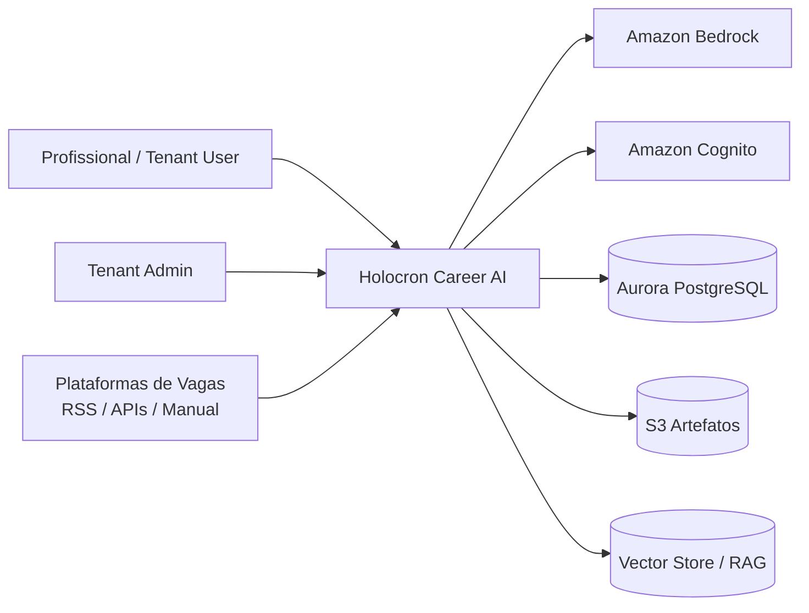
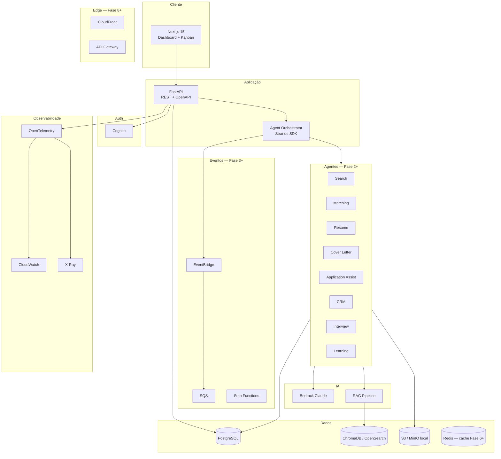
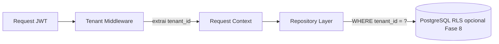
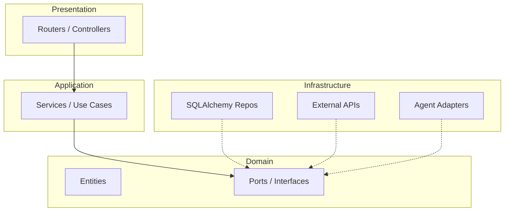

# Arquitetura Técnica — Holocron Career AI

## Visão C4 — Contexto



---

## Visão C4 — Containers (Fase 1 local → Fase 8 AWS)



---

## Decisões sync vs async

| Fluxo | Modo | Justificativa |
|---|---|---|
| CRUD vagas/candidaturas | **Sync** REST | UX imediata, baixa latência |
| Login / refresh token | **Sync** | Padrão OAuth2 |
| Search Agent (RSS) | **Async** SQS + worker | Pode demorar; não bloqueia UI |
| Matching Agent | **Async** (job) | LLM + RAG > 5s |
| Resume / Cover Letter | **Async** (job) | Geração longa; polling ou SSE |
| Learning Agent | **Async** batch | Processamento noturno |
| Dashboard KPIs | **Sync** (cache 5min) | Agregações pré-computadas |

---

## Multi-tenant



**Estratégia:** shared database, shared schema, `tenant_id` em todas as tabelas de negócio.

**RLS PostgreSQL:** habilitar na Fase 8 (produção AWS).

---

## Stack por camada

| Camada | Tecnologia | Fase |
|---|---|---|
| Frontend | Next.js 15, Tailwind, shadcn/ui (dark) | 1 |
| API | FastAPI, Pydantic v2, async SQLAlchemy 2 | 1 |
| Auth | Cognito User Pool + JWT | 1 |
| DB | PostgreSQL 16 + Alembic | 1 |
| Agentes | Strands Agents SDK + Bedrock | 2+ |
| RAG | ChromaDB (local) → Bedrock KB (prod) | 3+ |
| Filas | In-process (Fase 2) → SQS (Fase 8) | 2+ |
| Storage | MinIO local → S3 | 4+ |
| IaC | Docker Compose (Fase 1) → Terraform (Fase 8) | 1 / 8 |
| CI/CD | GitHub Actions | 1 |
| Observabilidade | structlog + OTEL → CloudWatch/X-Ray | 1 / 8 |

---

## Segurança (Zero Trust lite)

| Controle | Implementação |
|---|---|
| AuthN | Cognito JWT (RS256) |
| AuthZ | RBAC: `tenant_admin`, `user`, `viewer` |
| Isolamento | `tenant_id` middleware + testes cross-tenant |
| Secrets | `.env` local → Secrets Manager |
| Criptografia | TLS in-transit; AES at-rest (RDS Fase 8) |
| Rate limit | slowapi 60 req/min/user |
| Auditoria | tabela `audit_logs` imutável |
| LGPD | consent flags, TTL, DELETE endpoint |

---

## Custo previsível (Fase 3+)

- Token budget por tenant/dia (configurável)
- Cache de embeddings (Redis, TTL 24h)
- Modelo barato para triagem; Sonnet para geração
- Batch Learning Agent 1x/dia

---

## Estrutura do monorepo

```
holocron-career-ai/
├── apps/
│   ├── api/                 # FastAPI
│   │   ├── src/
│   │   │   ├── domain/
│   │   │   ├── application/
│   │   │   ├── infrastructure/
│   │   │   └── presentation/
│   │   ├── alembic/
│   │   └── tests/
│   └── web/                 # Next.js
├── packages/
│   ├── agents/              # Strands agents
│   ├── core/                # DTOs, ports, shared
│   └── rag/                 # ingestion, retrieval
├── infra/
│   ├── docker/
│   │   └── docker-compose.yml
│   └── terraform/           # Fase 8
├── docs/
│   ├── adr/
│   ├── openapi/
│   │   └── openapi.yaml
│   └── architecture/
├── scripts/
│   └── import-candidaturas.py
├── .github/workflows/
└── README.md
```

---

## Clean Architecture (backend)



Dependência sempre aponta para dentro (Domain no centro).
