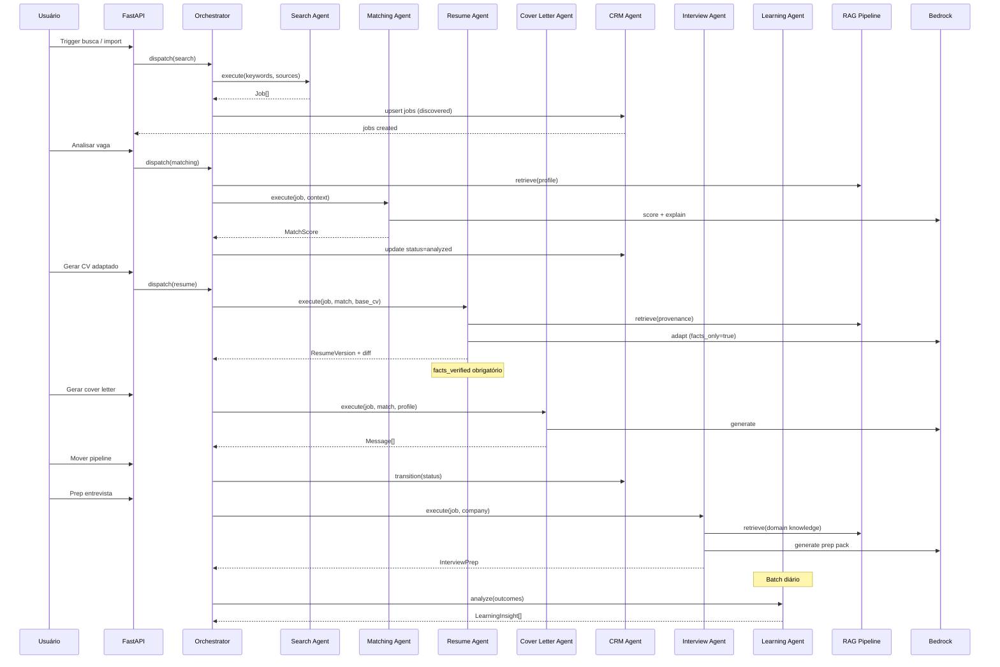
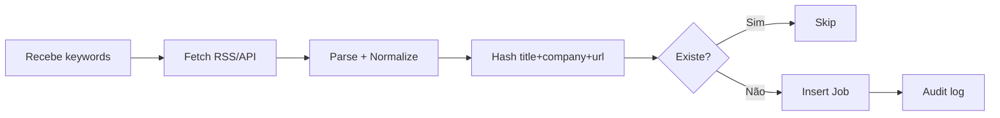

# Fluxos de Agentes

## Contrato base (todos os agentes)

```yaml
AgentInput:
  tenant_id: uuid
  user_id: uuid
  trace_id: string
  payload: object

AgentResult:
  agent_id: string
  success: boolean
  output: object
  confidence: float        # 0.0 - 1.0
  facts_verified: boolean
  sources: string[]        # refs RAG
  tokens_used: int
  latency_ms: int
  trace_id: string
  error: string | null
```

---

## Orquestração global



---

## Agent 1 — Search Agent

**Input:**
```yaml
keywords: string[]
sources: enum[rss, api, manual]
filters:
  location: string
  remote: boolean
  seniority: string[]
favorite_companies: uuid[]
```

**Output:**
```yaml
jobs: Job[]
deduplicated_count: int
source_breakdown: {rss: int, api: int, manual: int}
```

**Fluxo:**


---

## Agent 2 — Matching Agent

**Input:** `job_id`, `user_id`

**Output:**
```yaml
total_score: 0-100
breakdown:
  hard_skills: {score, weight: 0.35, evidence[], gaps[]}
  seniority: {score, weight: 0.20, ...}
  aws_alignment: {score, weight: 0.15, ...}
  location: {score, weight: 0.10, ...}
  salary: {score, weight: 0.10, ...}
  language: {score, weight: 0.05, ...}
  company_fit: {score, weight: 0.05, ...}
recommendation: apply | maybe | skip
explanation: string
```

---

## Agent 3 — Resume Agent

**Input:** `job_id`, `base_resume_version_id`

**Output:**
```yaml
resume_version_id: uuid
content_md: string
ats_score: 0-100
facts_verified: boolean
diff:
  - field: string
    before: string
    after: string
    reason: string
provenance:
  - field: string
    source_doc: string
    excerpt: string
blocked_fields: []  # se tentou inventar
```

**Regra:** se `facts_verified=false` → não exportar PDF.

---

## Agent 4 — Cover Letter Agent

**Output:**
```yaml
cover_letter: string
linkedin_message: string  # max 300 chars
email: {subject, body}
anti_generic_score: 0-100
```

---

## Agent 5 — Application Assist Agent

**Modo MVP:** assistido (checklist + screenshots), não autofill.

**Output:**
```yaml
checklist: {field, value, filled: boolean}[]
screenshots: s3_url[]
extra_questions: string[]
submitted: boolean
```

---

## Agent 6 — CRM Agent

**Input:** evento de transição ou nota

**Output:**
```yaml
application_id: uuid
new_status: string
event_id: uuid
next_actions: string[]
kpis_delta: object
```

---

## Agent 7 — Interview Agent

**Output:**
```yaml
technical_questions: {question, topic, difficulty}[]
behavioral_questions: {question, star_hint}[]
aws_architecture_scenarios: string[]
python_questions: string[]
study_plan:
  - topic: string
    resources: string[]
    hours: float
checklist_pre_interview: string[]
```

---

## Agent 8 — Learning Agent

**Input:** histórico 30 dias de outcomes

**Output:**
```yaml
insights:
  - type: correlation | trend | recommendation
    description: string
    confidence: 0-1
    evidence_count: int
suggested_adjustments:
  keywords: string[]
  target_companies: string[]
  resume_strategy: string
```

**Regra:** nunca afirmar causalidade; apenas correlação + confiança.

---

## Interface LLM (provider abstrato)

```python
class LLMProvider(Protocol):
    async def complete(
        self,
        messages: list[Message],
        model: str,
        max_tokens: int,
        temperature: float,
    ) -> LLMResponse: ...

# Implementações: BedrockProvider, OpenAIProvider, OllamaProvider
```

Provider padrão: **Bedrock Claude 3.5 Sonnet**. Fallback dev: **Ollama**.
