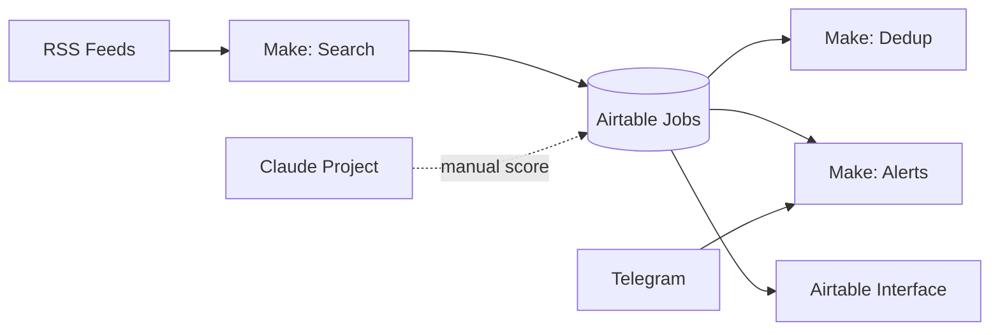

# Cenários Make.com — Holocron Career AI

> Plano free: 1000 operations/mês. Priorize cenários essenciais.

---

## Cenário 1 — RSS → Airtable (Search Agent)

**Trigger:** Schedule — todo dia 07:00

**Fluxo:**
```
[RSS RemoteOK - AWS/Cloud filter]
    → [Text parser: title, link, description]
    → [Router: keyword match cloud|aws|python|devops]
    → [Airtable Search Records: Content Hash exists?]
        → Não existe: [Airtable Create Record em Jobs]
        → Existe: [Ignore]
    → [Optional: Telegram notification "X vagas novas"]
```

**Operations estimadas:** ~5/dia × 30 = 150/mês por feed

**Feeds sugeridos:**
- `https://remoteok.com/remote-aws-jobs.rss`
- `https://remotive.com/remote-jobs/feed` (filtrar depois)

---

## Cenário 2 — Dedup secundário (backup)

**Trigger:** Airtable — When record created in Jobs

**Fluxo:**
```
[New Job]
    → [Search duplicates: same Title + Company last 30 days]
    → [If count > 1: Update Status = Skipped, add note "duplicate"]
```

---

## Cenário 3 — Alerta vaga high-match (Fase 3)

**Trigger:** Airtable — When Match Score updated ≥ 70

**Fluxo:**
```
[Match Score ≥ 70]
    → [Telegram/Email: "🔥 {Title} @ {Company} — Score {Score}"]
    → [Update Application Next Action = "Aplicar hoje"]
```

---

## Cenário 4 — Lembrete follow-up

**Trigger:** Schedule — todo dia 09:00

**Fluxo:**
```
[Airtable Search: Next Action Date = today AND Status NOT IN (Rejected, Hired)]
    → [Aggregate list]
    → [Telegram: "📋 Follow-ups hoje: ..."]
```

---

## Cenário 5 — HTTP Claude Match Score (opcional, Fase 3)

**Trigger:** Airtable button "Calcular Match" (via webhook Make)

**Fluxo:**
```
[Webhook recebe job_id]
    → [Airtable Get Job description]
    → [HTTP POST api.anthropic.com/messages]
        Body: prompt Matching Agent + description
    → [Parse JSON response: score, breakdown]
    → [Airtable Update Job: Match Score, Match Notes]
```

**Nota:** consome ops + tokens. Alternativa mais simples: **Claude Project manual** (zero Make ops).

---

## Diagrama geral



---

## Limites Make free

| Cenário | Ops/mês est. |
|---|---|
| RSS daily | ~150 |
| Dedup | ~100 |
| Follow-up daily | ~60 |
| Alerts | ~50 |
| **Total** | **~360** ✅ cabe no free |

---

## Export para portfólio

- Screenshot do canvas Make.com
- Export blueprint JSON (Share scenario)
- Documentar no Obsidian com diagrama acima
