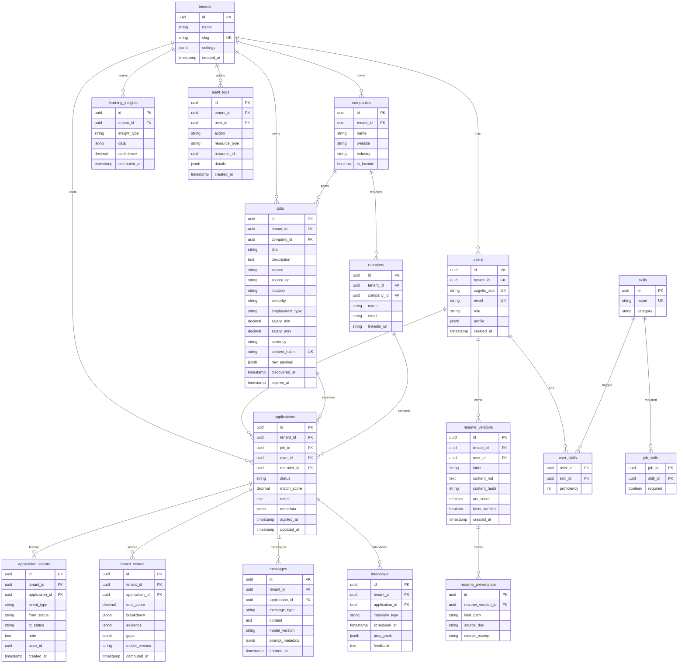

# Modelo de Dados — PostgreSQL

> Schema inicial Fase 1. Todas as tabelas de negócio incluem `tenant_id UUID NOT NULL`.

---

## Diagrama ER (Fase 1 + extensões futuras)



---

## Estados do pipeline (`applications.status`)

```
discovered → analyzed → applied → screening → hr_interview →
tech_interview → case → offer → rejected → hired → archived
```

Transições validadas no service layer (máquina de estados).

---

## Índices recomendados

```sql
-- Multi-tenant (todas as queries)
CREATE INDEX idx_jobs_tenant ON jobs(tenant_id);
CREATE INDEX idx_applications_tenant_status ON applications(tenant_id, status);
CREATE INDEX idx_applications_tenant_updated ON applications(tenant_id, updated_at DESC);

-- Deduplicação
CREATE UNIQUE INDEX idx_jobs_hash_tenant ON jobs(tenant_id, content_hash);

-- Busca
CREATE INDEX idx_jobs_title_trgm ON jobs USING gin(title gin_trgm_ops);
CREATE INDEX idx_companies_name_trgm ON companies USING gin(name gin_trgm_ops);

-- Match scores histórico
CREATE INDEX idx_match_scores_app ON match_scores(application_id, computed_at DESC);

-- Auditoria LGPD
CREATE INDEX idx_audit_tenant_time ON audit_logs(tenant_id, created_at DESC);
```

---

## Migrações Alembic

| Revisão | Conteúdo | Fase |
|---|---|---|
| `001_initial` | tenants, users, companies, jobs, applications | 1 |
| `002_events` | application_events, recruiters | 1 |
| `003_skills` | skills, user_skills, job_skills | 3 |
| `004_matching` | match_scores | 3 |
| `005_resumes` | resume_versions, resume_provenance | 4 |
| `006_messages` | messages | 5 |
| `007_interviews` | interviews | 7 |
| `008_learning` | learning_insights | 8 |
| `009_audit` | audit_logs | 1 (já na 001 se possível) |

---

## Versionamento de documentos

- CV/carta: imutável por versão (`resume_versions.content_hash`)
- Provenance: cada campo editado referencia fonte RAG
- S3 path: `s3://{tenant_id}/resumes/{version_id}.pdf`

---

## Seed Fase 1

```sql
INSERT INTO tenants (id, name, slug) VALUES
  ('00000000-0000-0000-0000-000000000001', 'Guilherme Personal', 'guilherme');

INSERT INTO users (id, tenant_id, cognito_sub, email, role) VALUES
  ('00000000-0000-0000-0000-000000000002',
   '00000000-0000-0000-0000-000000000001',
   'local-dev', 'guilherme@dev.local', 'tenant_admin');
```
