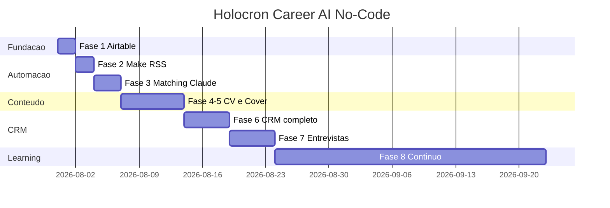

# Roadmap No-Code — 8 Fases

> Mesma ordem lógica do roadmap código, adaptada para ferramentas visuais.

---

## Fase 1 — Fundação (Dia 1–2)

| Tarefa | Ferramenta |
|---|---|
| Criar base Airtable | Airtable |
| Tabelas: Companies, Jobs, Applications, Recruiters, Events | Airtable |
| Views: Inbox, Kanban, Calendar | Airtable |
| Import candidaturas atuais | CSV manual |
| Interface Dashboard básica | Airtable Interfaces |

**Aceite:**
- [ ] 10 candidaturas importadas de CONTROLE_CANDIDATURAS
- [ ] Kanban funcional
- [ ] Dashboard com contadores

---

## Fase 2 — Busca de Vagas (Dia 3–4)

| Tarefa | Ferramenta |
|---|---|
| Cenário RSS RemoteOK | Make.com |
| Cenário RSS Remotive | Make.com |
| Dedup por Content Hash | Make.com |
| Alerta Telegram vagas novas | Make.com |

**Aceite:**
- [ ] ≥ 10 vagas importadas automaticamente
- [ ] Zero duplicatas
- [ ] Inbox populada daily

---

## Fase 3 — Matching (Dia 5–7)

| Tarefa | Ferramenta |
|---|---|
| Claude Project criado + docs anexados | Claude |
| Prompt /match testado | Claude |
| Campo Match Score no Airtable | Airtable |
| View Score ≥ 70 | Airtable |

**Aceite:**
- [ ] Score + explicação para 5 vagas reais
- [ ] Decisão apply/skip documentada

---

## Fase 4 — Currículo (Semana 2)

| Tarefa | Ferramenta |
|---|---|
| Prompt /resume | Claude |
| Campo Resume Version | Airtable |
| Export PDF (Claude → copiar → Google Docs → PDF) | Manual |

**Aceite:**
- [ ] 2 versões CV geradas com diff
- [ ] facts_verified confirmado manualmente

---

## Fase 5 — Mensagens (Semana 2)

| Tarefa | Ferramenta |
|---|---|
| Prompt /cover | Claude |
| Attachment Cover Letter no Airtable | Airtable |
| Templates salvos no Obsidian | Obsidian |

**Aceite:**
- [ ] Cover + LinkedIn msg para 3 vagas reais

---

## Fase 6 — CRM Completo (Semana 3)

| Tarefa | Ferramenta |
|---|---|
| Tabela Events populada | Airtable |
| Recruiters vinculados | Airtable |
| Cenário follow-up diário | Make.com |
| KPIs na Interface | Airtable |

**Aceite:**
- [ ] Timeline de eventos por candidatura
- [ ] Lembrete follow-up funcionando

---

## Fase 7 — Entrevistas (Semana 3–4)

| Tarefa | Ferramenta |
|---|---|
| Prompt /interview | Claude |
| Campo prep pack (long text) | Airtable |
| Checklist pré-entrevista | Obsidian template |

**Aceite:**
- [ ] Prep pack para próxima entrevista real

---

## Fase 8 — Aprendizado (Contínuo)

| Tarefa | Ferramenta |
|---|---|
| Prompt /learn semanal | Claude |
| Gráficos Airtable | Airtable |
| Nota revisão semanal Obsidian | Obsidian |
| Post LinkedIn mensal com métricas | LinkedIn |

**Aceite:**
- [ ] 4 revisões semanais documentadas
- [ ] 1 insight acionável por semana

---

## Timeline visual

**Total até CRM funcional completo: ~2 semanas** (vs 2+ meses codando).
