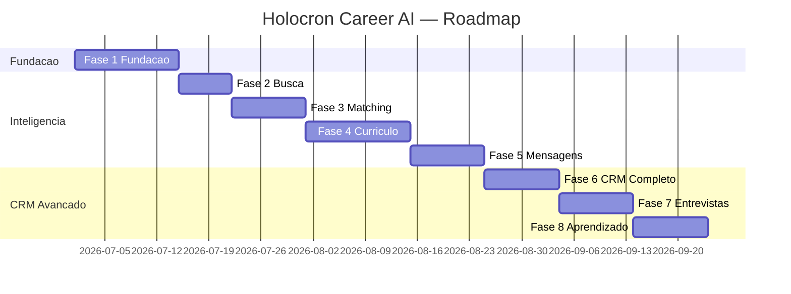
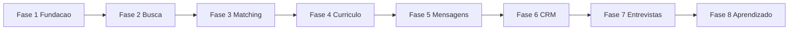

# Roadmap — 8 Fases (ordem obrigatória)

> Implementar exatamente nesta sequência. Cada fase só inicia quando a anterior atinge critérios de aceite.

---

## Visão geral

---

## Fase 1 — Fundação

**Objetivo:** CRM funcional com auth, CRUD e dashboard.

| Entrega | Detalhe |
|---|---|
| Monorepo | `apps/api`, `apps/web`, `packages/core` |
| Backend | FastAPI async, Clean Architecture |
| Frontend | Next.js 15, shadcn dark, layout dashboard |
| Banco | PostgreSQL Docker + Alembic migrations |
| Auth | Cognito dev pool + JWT middleware + RBAC |
| CRUD | Jobs, Applications, Companies |
| Dashboard | KPI cards + tabela candidaturas |
| Testes | pytest services ≥ 70% |
| Docs | README, ADR-001 a ADR-005, OpenAPI |

### Critérios de aceite Fase 1

- [ ] `docker compose up` sobe API + Web + PostgreSQL
- [ ] Migrations rodam sem erro
- [ ] Login funciona (Cognito ou dev bypass)
- [ ] CRUD jobs/applications/companies via API
- [ ] Swagger em `/docs` documentado
- [ ] Dashboard consome API com dados reais
- [ ] Import `CONTROLE_CANDIDATURAS.md` funcional
- [ ] Testes CI passando no GitHub Actions
- [ ] Zero query sem `tenant_id`

### PRs sugeridos

1. `chore: monorepo scaffold + docker compose`
2. `feat: domain models + alembic 001_initial`
3. `feat: auth cognito + tenant middleware`
4. `feat: CRUD jobs applications companies`
5. `feat: dashboard shell + KPI cards`
6. `feat: import candidaturas markdown`
7. `test: service layer + CI workflow`

---

## Fase 2 — Busca de Vagas

**Objetivo:** Search Agent + ingestão automática.

| Entrega | Detalhe |
|---|---|
| Search Agent | Strands SDK |
| RSS | RemoteOK, Remotive |
| API | Adzuna (se key disponível) |
| Manual | Import URL + paste |
| Dedup | hash(title+company) |
| Normalização | seniority, location, stack tags |

### Aceite

- [ ] ≥ 20 vagas importadas automaticamente
- [ ] Zero duplicatas (mesmo hash)
- [ ] Jobs aparecem como `discovered` no CRM
- [ ] Job ingestion async (background task)

---

## Fase 3 — Matching Inteligente

**Objetivo:** Score 0–100 explicável com RAG.

| Entrega | Detalhe |
|---|---|
| RAG pipeline | ChromaDB + ingest assets |
| Matching Agent | Bedrock + breakdown |
| UI | Score badge + explicação |
| Filtros | min_score, sort by score |
| Histórico | match_scores table |

### Aceite

- [ ] Score para qualquer vaga em < 15s
- [ ] Breakdown com ≥ 3 evidências RAG
- [ ] Filtro por score no dashboard
- [ ] Histórico de scores por candidatura

---

## Fase 4 — Currículo

**Objetivo:** Resume Agent com provenance.

| Entrega | Detalhe |
|---|---|
| Resume Agent | adaptação ATS |
| Versões | resume_versions CRUD |
| ATS score | heurística + LLM |
| Diff UI | before/after |
| Export | PDF via WeasyPrint |

### Aceite

- [ ] Versão gerada sem inventar fatos
- [ ] `facts_verified` flag funcional
- [ ] Diff visual de alterações
- [ ] Export PDF

---

## Fase 5 — Mensagens

**Objetivo:** Cover Letter + LinkedIn + email.

| Entrega | Detalhe |
|---|---|
| Cover Letter Agent | personalizada |
| Templates | versionados por tenant |
| Anti-genérico | score repetição |

### Aceite

- [ ] 3 formatos gerados por vaga
- [ ] Nenhum template genérico (score > 80 anti-generic)
- [ ] Mensagens salvas com audit trail

---

## Fase 6 — CRM Completo

**Objetivo:** Pipeline avançado + Kanban + recrutadores.

| Entrega | Detalhe |
|---|---|
| Kanban | drag-and-drop 11 estados |
| Eventos | application_events timeline |
| Recrutadores | CRUD + link candidatura |
| Feedbacks | por etapa |
| Próximas ações | sugeridas por CRM Agent |

### Aceite

- [ ] Kanban funcional com persistência
- [ ] Timeline de eventos por candidatura
- [ ] Recrutador vinculado
- [ ] Feedback registrado por etapa

---

## Fase 7 — Entrevistas

**Objetivo:** Interview Agent + prep pack.

| Entrega | Detalhe |
|---|---|
| Interview Agent | perguntas + STAR |
| Plano estudo | por vaga |
| Checklist | pré-entrevista |

### Aceite

- [ ] Prep pack gerado para candidatura em `hr_interview` ou `tech_interview`
- [ ] ≥ 10 perguntas técnicas AWS
- [ ] ≥ 5 comportamentais STAR

---

## Fase 8 — Aprendizado Contínuo

**Objetivo:** Learning Agent + analytics avançado.

| Entrega | Detalhe |
|---|---|
| Learning Agent | correlações |
| Analytics | gráficos tendência |
| Recomendações | keywords, empresas |
| AWS deploy | ECS Fargate + Aurora + Cognito |

### Aceite

- [ ] Insights semanais automáticos
- [ ] Dashboard analytics completo
- [ ] Deploy staging AWS funcional

---

## Dependências entre fases

**Nota:** Fase 6 (CRM avançado) enriquece o CRM básico da Fase 1 — não substitui.
